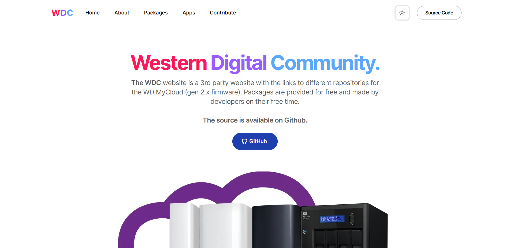
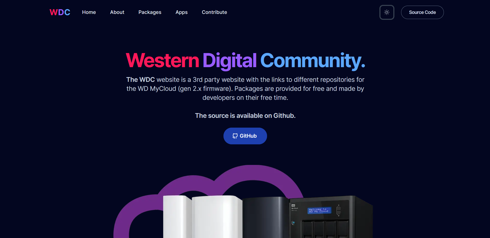

<h1 align="center">
   
  
   
  WDCommunity Website
   
</h1>

<h4 align="center">Unofficial Website for the <a href="https://github.com/WDCommunity" target="_blank">WDCommunity</a>.</h4>

  

  

### Commands

All commands are run from the root of the project, from a terminal:

| Command               | Action                                             |
| :-------------------- | :------------------------------------------------- |
| `npm install`         | Installs dependencies                              |
| `npm run dev`         | Starts local dev server at `localhost:3000`        |
| `npm run build`       | Build your production site to `./dist/`            |
| `npm run preview`     | Preview your build locally, before deploying       |
| `npm run format`      | Format codes with Prettier                         |
| `npm run lint:eslint` | Run Eslint                                         |
| `npm run astro ...`   | Run CLI commands like `astro add`, `astro preview` |

 

## Contributing

If you have any idea, suggestions or find any bugs, feel free to open a discussion, an issue or create a pull request.
That would be very useful for all of us and we would be happy to listen and take action.

## Acknowledgements

This is a fork from the Astro Theme [AstroWind](https://github.com/onwidget/astrowind).

- Initially created by [onWidget](https://onwidget.com) and maintained by a community of [contributors](https://github.com/onwidget/astrowind/graphs/contributors).

## License

This project is licensed under the [MIT](LICENSE.md) License - see the [LICENSE.md](LICENSE.md) file for more details.
